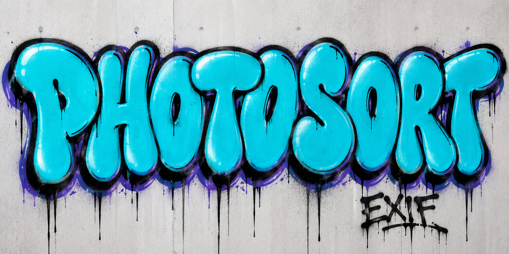

# PhotoSort / PhotoSweep 📸

PhotoSweep is a native C photo-analysis and review toolkit descended from the original PhotoSort PHP keyboard sorter. PhotoSort uses the companion [Csharp](https://github.com/LuckyMonkey/Csharp) repository when HEIC/HEIF files need safe JPEG derivatives; Csharp converts, PhotoSweep analyzes and reviews.

The old PHP implementation and historical research material are preserved on the **`archive/legacy-snapshot`** branch rather than cluttering the active `master` tree.

## Start here 🚀

```sh
make clean all
make check
bin/photosweep run all /path/to/photo-library /tmp/photosweep-demo/reports
bin/photosweep chooser /tmp/photosweep-demo/reports/swatch.jsonl
```

Open the printed localhost URL to review the report. Analysis is read-only: it does not move files, delete duplicates, rewrite EXIF, or upload GPS data.

### The complete pipeline

```text
📥 source → verified staging copy
         → Csharp (optional HEIC/HEIF → JPEG derivative)
         → PhotoSweep inventory + SHA-256 identity
         → 🔤 OCR · 🙂 faces · 📍 GPS · 🎨 swatch · 🖼️ raster passes
         → append-only reports
         → 🖥️ human review
         → optional, explicit organization / metadata repair / cleanup
```

## Documentation map

| Need | Read |
|---|---|
| Level-2 documentation index | [`docs/README.md`](docs/README.md) |
| Import from phones, cameras, SD cards, clouds, old disks | [`docs/import-sources.md`](docs/import-sources.md) |
| Long-form EXIF + manual camera settings guide | [`docs/exif.md`](docs/exif.md) |
| Complete workflow | [`docs/workflow.md`](docs/workflow.md) |
| Architecture and data flow | [`docs/architecture.md`](docs/architecture.md) |
| OCR sweep | [`docs/sweeps/ocr.md`](docs/sweeps/ocr.md) |
| Face sweep | [`docs/sweeps/faces.md`](docs/sweeps/faces.md) |
| Face identity workflow | [`docs/sweeps/face-identity.md`](docs/sweeps/face-identity.md) |
| GPS/GIS sweep | [`docs/sweeps/gps.md`](docs/sweeps/gps.md) |
| Swatch and duplicates | [`docs/sweeps/swatch.md`](docs/sweeps/swatch.md) |
| Duplicate comparison tool | [`docs/duplicate-review.md`](docs/duplicate-review.md) |
| Production demo | [`docs/production-demo.md`](docs/production-demo.md) |
| Operations and privacy | [`docs/operations.md`](docs/operations.md) |
| Function reference | [`docs/function-reference.md`](docs/function-reference.md) |
| C development | [`docs/development.md`](docs/development.md) |
| Csharp integration | [`docs/integration-csharp.md`](docs/integration-csharp.md) |
| Rules and thresholds | [`rules/photosweep.yaml`](rules/photosweep.yaml) |

## Commands

```text
bin/photosweep run ocr    ROOT OUTDIR
bin/photosweep run faces  ROOT OUTDIR
bin/photosweep run gps    ROOT OUTDIR
bin/photosweep run swatch ROOT OUTDIR
bin/photosweep run all    ROOT OUTDIR
bin/photosweep chooser    REPORT [PORT]
```

Each sweep appends one JSON object per image. Records include path, byte size, and SHA-256 identity. Optional tools produce explicit `unavailable` or `error` states instead of silently inventing results.

## Filter methods 🔎

- **File filter:** walks regular files and ignores unsupported extensions.
- **Identity filter:** SHA-256 proves exact byte duplicates.
- **Metadata filter:** extracts GPS, camera/date evidence, and dimensions without changing the source.
- **OCR filter:** records detected text or a clear status.
- **Face filter:** records face presence/count; it does not claim identity.
- **Visual filter:** swatch/dHash similarity creates review candidates, never automatic deletion.
- **Raster filter:** classifies dimensions and likely screenshots using configured rules.

## Comparison tool 🖥️

The visual report is a review queue, not a deletion command. The comparison workflow keeps mutation behind a human decision gate and uses a review quarantine where applicable. See [`docs/duplicate-review.md`](docs/duplicate-review.md).

## Design promises

- C is the active implementation language.
- Original files are inputs, never implicit outputs.
- Exact duplicates use SHA-256; similarity is only a review signal.
- Metadata repair is evidence-based and explicit.
- GPS, OCR, and face reports stay local unless deliberately exported.
- Historical material stays available without living in the active source tree.
